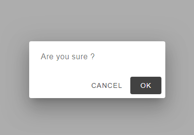
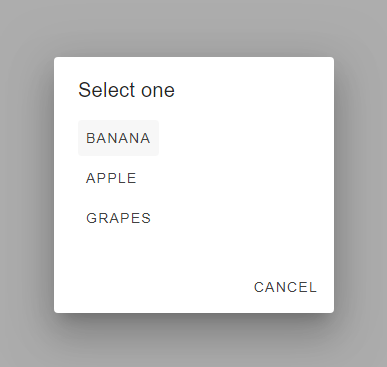
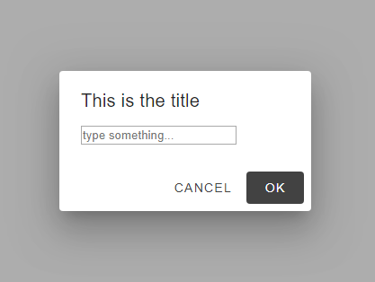

# mwc-app-dialog

Unofficial material web component wrapper to manage a mwc-dialog in your application.

## Usages

First import the element in your project

```javascript
import 'mwc-app-dialog'
```

Then in your HTML

```html
<mwc-app-dialog id="dialog"></mwc-app-dialog>
```

and now using JavaScript

```javascript
const dialog = ....getElementById('dialog')
// see below to see the features
```

### confirm

```javascript
try {
  await dialog.confirm('', 'Are you sure ?')
  // or (with a title)
  // await dialog.confirm('Please confirm', 'Are you sure ?')
  // or (just the title (bolder))
  // await dialog.confirm('Are you sure ?')
} catch (e) {
  // cancelled
  return 
}
// accepted, continue the procedure
```



### choices

```javascript
let fruit
try {
  fruit = await dialog.choices(['banana', 'apple', 'grapes'])
} catch (e) {
  // cancelled
  return 
}
alert(`I see you like ${fruit}`)
```



### Custom

```javascript
try {
  await dialog.open('this is the title', html`
    <form id="form">
      <input type="text" name="foo" placeholder="type something...">
    </form>
    `,
    (dom) => {
      alert(`you've typed "${dom.form.foo.value}"`)
    }
  )
} catch (e) {
  // cancelled
  return
}
```



## Installation

```npm i mwc-app-dialog```


## Demo

If you want to see a live demo :
- clone this repository
- install dependencies : `npm install`
- type `npm run demo` . This will open the demo in the browser

## Contact

vdegenne (at) gmail (dot) com

