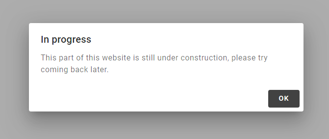

# mwc-app-dialog

Unofficial material web component wrapper to manage a mwc-dialog in your application.

## Usages

First import the element in your project

```javascript
import 'mwc-app-dialog'
```

Then in your HTML

```html
<mwc-app-dialog id="dialog"></mwc-app-dialog>
```

and now using JavaScript

```javascript
const dialog = ....getElementById('dialog')
// see below to see the features
```

### Notice



```javascript
dialog.notice('In progress', 'This part of this website is still under construction, please try coming back later.')
```
or blocking
```javascript
await dialog.notice('In progress', 'This part of this website is still under construction, please try coming back later.')
console.log('you just closed the dialog')
```

### Confirm


```javascript
try {
  await dialog.confirm('', 'Are you sure ?')
  // or (with a title)
  // await dialog.confirm('Please confirm', 'Are you sure ?')
  // or (just the title (bolder))
  // await dialog.confirm('Are you sure ?')
} catch (e) {
  // cancelled
  return 
}
// accepted, continue the procedure
```

### Choices


```javascript
let fruit
try {
  fruit = await dialog.choices(['banana', 'apple', 'grapes'])
} catch (e) {
  // cancelled
  return 
}
alert(`I see you like ${fruit}`)
```

### Custom


```javascript
await dialog.open('this is the title', html`
  <form id="form">
    <input type="text" name="foo" placeholder="type something...">
  </form>
  `,
  (dom) => {
    alert(`You've typed "${dom.form.foo.value}"`)
  },
  () => {
    alert('cancelled')
  }
)
```

If you want to prevent the dialog from closing (e.g. when you need to validate a form but it has an error the user needa fix) returns `-1` from the `onAccept` function.

```javascript
await dialog.open('title', html`<input type="text" id="myinput">`, (dom) => {
  if (dom.myinput.value === '') {
    alert('please enter a value')
    return -1 // the dialog will stay open
  }
  else {
    alert('thanks !')
    // the dialog will close by default
  }
})
```

If you want a custom function without an accept button, just pass `undefined` instead of a function for the third argument :

```javascript
await dialog.open('title', html`<p>test</p>`, undefined, onCancel) // only cancellable
```

## Other features

### catch dom

You can also catch the dom (rendered content of the dialog) to make post-manipulation :

```javascript
const dom = await dialog.open('title', html`<p id=myparagraph>hello I am red</p>`, onAccept, onCancel)dom.myparagraph.style.color = 'red'
```

### make your own selection dialog (`dialogAction`)

```javascript
await dialog.open('select one', html`
  <span dialogAction="first">first</span>
  <span dialogAction="second">second</span>
  `,
  (dom, choice) => {
    console.log(`You choosed ${choice} !`)
  }
)
```

## Installation

```npm i mwc-app-dialog```


## Demo

If you want to see a live demo :
- clone this repository
- install dependencies : `npm install`
- type `npm run demo` . This will open the demo in the browser

## Contact

vdegenne (at) gmail (dot) com

